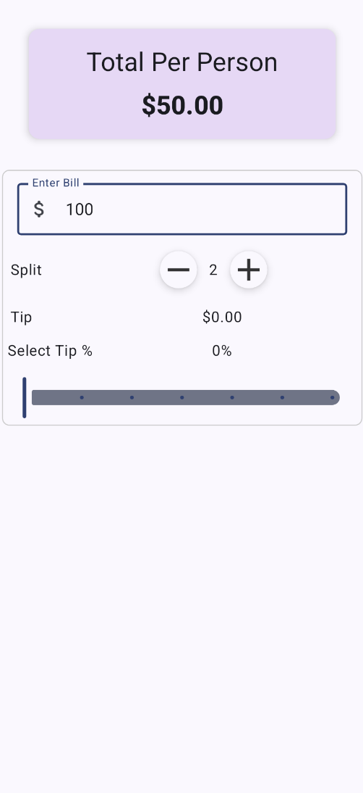
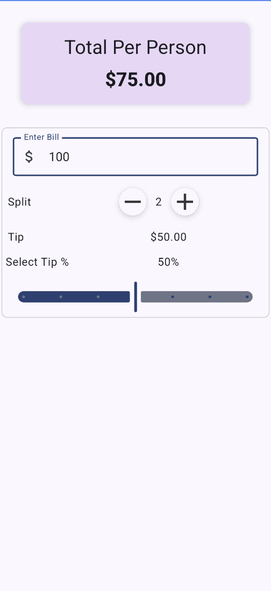

# TipEase

**TipEase** is a sleek, user-friendly tip calculator app built with **Jetpack Compose**. This app makes it easy to calculate tips, split bills among multiple people, and determine the total per person—all in a few taps!

---

## Features

- 🎯 Effortlessly calculate tips for any bill amount.
- 🧾 Split bills between 1 to 100 people.
- 📈 Adjust tip percentage using an intuitive slider.
- 💵 View real-time updates for the total per person and total tip amount.
- 🎨 Modern and responsive UI built using **Jetpack Compose**.

---

## Screenshots

### Home Screen


### Split Bill Feature


### Adjust Tip Percentage


---

## Getting Started
- com.example.jettipapp
    - components/       # Reusable UI components like InputField
    - ui/theme/         # Theme and styling for the app
    - util/             # Utility functions for calculations
    - widgets/          # Custom widgets like RoundIconButton
    - MainActivity.kt   # The entry point of the app
    - BillForm.kt       # Core composable for tip calculation and bill splitting
    - TopHeader.kt      # Header composable showing total per person

---

### Clone the Repository
To get a local copy of the project up and running, clone the repository:
```bash
git clone https://github.com/MohammedYusuf-123/TipEase.git
cd tipease
### Contributions are welcome! Follow these steps to contribute:
	1.	Fork the Repository: Click the “Fork” button on GitHub.
	2.	Create a Branch: Create a new branch for your feature:
